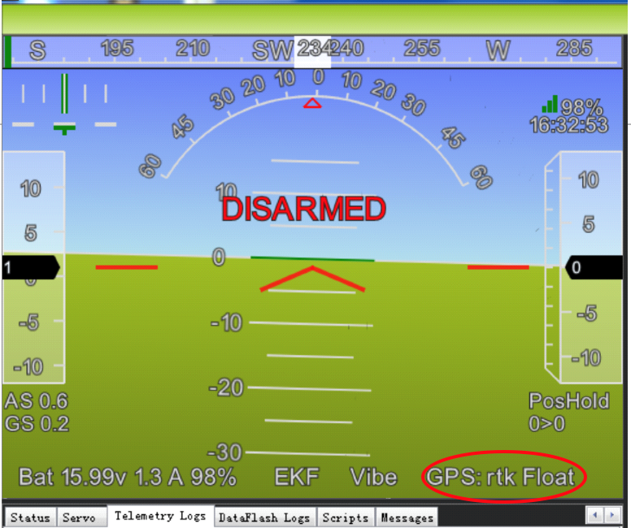

.. _common-here-plus-gps:

=============
Here+ RTK GPS
=============

This article provides a brief overview of how to setup a Here+ RTK GPS receiver which is based on the Ublox M8P.
Like other RTK GPSs, the Here+ can provide much more accurate position estimates than regular GPSs but normally requires the use of a 2nd GPS connected to the ground station.
These instructions focus on the setup using Mission Planner on Windows but in the future other ground stations (i.e. QGroundControl) will also support this GPS.

.. image:: ../../../images/here-plus-gps.png
	:target: ../_images/here-plus-gps.png

.. note::

     Here+ RTK GPS is supported in Copter-3.5 (and higher), Plane 3.8.0 (and higher)

Where to buy
============

See a list of `Proficnc resellers here <http://www.proficnc.com/stores>`__ or you can purchase directly from `Proficnc.com <http://www.proficnc.com/gps/77-gps-module.html>`__.

Connecting the vehicle and base station GPSs
============================================

The Here+ GPS kit comes with a larger round GPS (also knows as the "Rover") that should be mounted on the vehicle so that the round button is on the top and the faint arrow is pointing forwards.

This GPS is connected to the flight controller using the supplied 8-pin clickmate connector (if using a Pixhawk2) or an optional 4pin+6pin DF13 connector (if using Pixhawk1).

A smaller GPS (also known as the "base station") labelled "here+" is also included along with it's external antenna.  This GPS is connected to the ground station PC using the supplied USB cable.

Below is a diagram showing how to connect the Here+ to a Pixhawk1.

.. image:: ../../../images/here-plus-pixhawk.png
	:target: ../_images/here-plus-pixhawk.png

Installing the Drivers
======================

Windows 10 users (and perhaps others) will need to download and install the `u-blox GNSS Standard Driver for Windows, v1.2.0.8 <https://www.u-blox.com/sites/default/files/products/tools/UBX-GNSS-CDC-ACM-windows_Driver_%28UBX-drv-v1.2.0.8%29.exe.zip>`__.

If this link is broken you may find a newer version is available under the "Driver" section of `this ublox page <https://www.u-blox.com/en/product-resources?f[0]=property_file_product_filter%3A2779>`__.

When first installed, the device may show up in the "sensors" catagory in device manager.  If this happens, please right click on it and "update driver" 
select 
"Browse my computer for driver software"
then select 
"Let me pick from a list of devices"
the next screen will show a list of possible drivers.  Select..
"USB Serial Device"
Select next and finish.

If installed correctly, when plugged in, the GPS should appear in the Device Manager as "USB Serial Device".

.. image:: ../../../images/here-plus-gps-windows-device.png
	:target: ../_images/here-plus-gps-windows-device.png

Upgrading to U-blox 1.30 Firmware
=================================
The default firmware version of the HERE + modules is ublox-1.10 firmware. The new version of 1.30 firmware includes new feature of fusing other satellite systems (Glonass / beidou) with GPS for RTK operations, effectively increasing the RTK positioning accuracy. Therefore, it is recommended that all users upgrade to 1.30 firmware before using HERE+. 
 
During the preparation of this guide, ublox-1.40 version of the firmware has also been released. 1.40 version firmware introduced a new feature called the mobile base station, that is, the base station need not be fixed in a location. For example, a base station may be placed on a moving vehicle or boat. Upgrading to Ublox-1.40 version is similar to upgrading to 1.30. For users who do not need to use the mobile baseline feature, upgrading to version 1.30 is sufficient.

Downloading U-centre UI and 1.30 Firmware
=========================================
Upgrading firmware requires the use of Ublox's Windows software U-center. To download U-center, please go to the `official website <https://www.u-blox.com/en/product/u-center-windows>`__. Then follow the prompts to install U-cent software. During the installation process, you will be prompted to install the device Driver, please ensure that only the Standard Driver For Windows is checked, as shown below. 
[Insert image here]

You will also need to download firmware `here <https://www.ublox.com/en/search?keywords=HPG+1.30>`__. Click the choice: u-blox M8 Flash Firmware 3.01 HPG 1.30 - ONLY for High Precision GNSS products.

Connect your HERE+ Base and Rover to Computer
=============================================
When upgrading the base station module, use the USB cable to connect the base station module to the computer USB interface, as shown in the following figure: 
[Insert image here]

When upgrading a Rover module, use a hexagonal screwdriver to open the case. The rover module has a USB interface connector identical to the base module, you can use the base module USB cable to connect rover to computer. In addition, during the firmware upgrading process, the rover module needs to be powered by connecting to flight controller, as shown in the following figure: 
[Insert image here]

Upgrading Process
=================
Open the U-center software, click the connection button (as shown in the red circle), select the com port that corresponds to your base/ rover module.
[Insert image here]
Click tools->u-blox 5 – 8 Flash Firmware Update, and click the settings as shown below:
[Insert image here]
In Firmware image, unzip and select the downloaded 1.30 Firmware.
For base module, chose the firmware with title: UBX_M8_301_HPG_130_REFERENCE_NEOM8P2.59a07babb501ba6a89ff87cac2f 2765f.bin  For rover module, choose the firmware: UBX_M8_301_HPG_130_ROVER_NEOM8P0.3ee86a9e4775e3335e742b53527fa5 d0.bin 
[Insert image here]
In Flash Information Structure(FIS) File, select Flash.xml，which is located in the installation address of U-centre software.
[Insert image here]
Click OK and wait for the firmware uploading to complete. Uploading usually takes only a minute or less. If the uploading is successful, the upgrade interface is displayed in green; if the upgrade is aborted, the interface is displayed in red. If the process is interrupted, or if it is not responding for a long time, the modules will need to be power cycled and uploading needs to be done again.

Check current Rover/Base firmware version
=========================================
When base/rover is already connected to U-center, click View, go to Message View -> UBX -> MON _> VER, you will see the interface below:
[Insert image here]
As shown in the figure, the current firmware version is FWVER = HPG 1.30 REF, indicating that the current firmware version is 1.30 for base module. 

Basic opperating manual
=======================
This part of the tutorial uses Mission Planner ground control software and Arducopter-3.5 flight control firmware for operating instructions. If you are using PX4 firmware and QGroundControl ground station software, please refer to `this link <https://docs.px4.io/en/advanced_features/rtk-gps.html>`__.

-Preperation before operation.
To use HERE+ on a UAV, you need the following hardware:
[Insert image1 of hardware]
Before using, make sure the hardware is connected correctly: The base station module is connected to the computer port through USB; a telemetry module is connected to another USB port of the same computer. For UAV, HERE + rover module is connected to the flight controller GPS connector, telemetry module is connected to the TELEM interface. 
[Insert image2 of hardware]

-Place vehicle and base stations so that their GPS antennas have a clear view of the sky (i.e. this will not work indoors!).
During operation, please place the base station in an outdoor environment with sufficient sky coverage to obtain a good satellite signal. Place the base station on a stable and elevated platform, such as a tripod.
[Insert image3 of hardware]

- Connect the "here+" base station to the ground station PC
- Connect to the vehicle's flight controller (i.e. Pixhawk, Pixhawk2, etc) using Mission Planner
- Open the Initial Setup >> Optional Hardware >> RTK GPS Inject screen
- Place the vehicle and base stations so that their GPS antennas have a clear view of the sky (i.e. this will not work indoors!).
- For first time setup in a new location, click the Enter Base Position button, make sure the dialogue box shows empty location information, as shown below:

.. image:: ../../../images/Here_Plus_MP1.png
	:target: ../_images/Here_Plus_MP1.png

Base module setting using Mission Planner
=========================================
Start with base module setup first. During the base station setup, the rover and the UAV do not need to be turned on. Open the Mission Planner ground station software on your computer and go to the initial setup -> Optional Hardware -> RTK / GPS Inject page. You will see the following page: 

.. image:: ../../../images/Mission_planner_1.png
	:target: ../_images/Mission_planner_1.png

Select the correct base module com port in the top left corner and click connect. In the SurveyIn Acc section, enter the absolute geographic accuracy that you expect your HERE + base station to achieve. In the Time column, enter the minimum survey time you expect. Click on Restart, the ground station will transfer the data you have entered to the HERE + base module, the base module will start a new round of surveying. You will see the following page: 

.. image:: ../../../images/Mission_planner_2.png
	:target: ../_images/Mission_planner_2.png

During the survey process, the right box will show the current survey status: Position is invalid: base station has not yet reached a valid location; In Progress: survey is still in progress; Duration: The number of seconds that the current surveying task has been executed; Observation: the number of observations acquired; Current Acc: Absolute geographic accuracy that the current base station can achieve. The green bar at the lower part of the Mission Planner page shows the satellites being detected and the signal strength related to each satellite. 
 
The base station needs a certain amount of time to meet the accuracy requirements of your input. Testing shows that, in an open area without shelter, to achieve the absolute accuracy of 2m takes a few minutes; to reach the absolute accuracy of less than 30cm takes around an hour; to reach the accuracy of 10cm takes a few hours. 
 
It should be noted that the absolute geographic accuracy of the base station here will affect the absolute geographic accuracy of the rover module without affecting the relative accuracy between the base station and rover. If your application does not require UAV with high absolute geographic accuracy, you do not need to set the base station's precision too high, resulting in long survey time. Even if the accuracy of the base station is 1.5 to 2 m, the position accuracy of the rover module relative to the base station can still reach centimeter level.

After the survey is complete, Mission Planner will display the following page:

.. image:: ../../../images/Mission_planner_3.png
	:target: ../_images/Mission_planner_3.png
	
In the RTCM box is shows that the base status indicator is green and both the GPS and Glonass satellite systems are green (if you want to change the satellite system, refer to the following section). The box on the right says Position is valid. 
 
To store the current location in the Mission Planner: Click Save Current Pos, enter a name in the dialog box, and click OK. As shown below, you can see your saved location in the list. Click the Use button for the location you saved. The base station will enter the fixed mode and the status will show Using FixedLLA. In the future, if you set the base station in the same location, you do not need to conduct survey again, just click the Use button that corresponds to the location you have saved. 

.. image:: ../../../images/Mission_planner_4.png
	:target: ../_images/Mission_planner_4.png

Rover Module and Flight Controller Setup 
========================================
After the base station is set up, you can turn on the UAV. Using the same Mission Planner to connect the telemetry module, the base station data will be transmitted through telemetry module to the HERE + rover module on the UAV. In the Mission Planner main page, you can see the current GPS status displayed as RTK Float / RTK Fixed / 3D RTK, indicating that the positioning of the UAV has entered the RTK mode. RTK Float is a floating-point solution; RTK Fixed is a fixed solution. RTK Fixed mode has a higher accuracy and requires better signal strength. 3D RTK is unified saying of RTK Float / RTK in the Mission Planner Chinese version. 

- In the SurveyIn Acc input box, key in the absolute accuracy of base station you wish to achieve, in the unit of meters (for example, 0.50 means 50cm accuracy). In the Time(s) input box, key in a reference time in seconds. Depending on your desired accuracy, the base station may take more than your input time to achieve the desired accuracy. 

.. image:: ../../../images/Here_Plus_MP2.png
	:target: ../_images/Here_Plus_MP2.png
	
- Select the COM port for the base station and press Connect (the baud rate drop-down normally does not need to be set because it is automatically detected)
- "M8P autoconfig" should be checked

.. image:: ../../../images/here-plus-gps-mission-planner.png
	:target: ../_images/here-plus-gps-mission-planner.png
	
- The satellite information will be visualized as green bars as shown in the screen shot below.

.. image:: ../../../images/Here_Plus_MP3.png
	:target: ../_images/Here_Plus_MP3.png		

A line of text will indicate the current status of the surveying:
SurveyIn indicates whether the survey has achieved the desired accuracy of base station, it will show ‘true’ when the survey has been completed.

InProgress shows whether the survey is still ongoing. A completed survey of the current base position is indicated by the status messages SurveyIn Valid: True, and InProgress: false.

Duration: the duration of the survey in seconds

Obs: number of observations used for the survey

Acc: current accuracy in meters

- When the survey is completed as indicated by the SurveyIn: True message, you may click the ‘Save current pos’ button and enter a name for the saved position.
- The RTK messages from base station is sent to vehicle by Mavlink message. In the main HUD of Mission Planer, the GPS status should display RTK Fix or RTK Float

.. image:: ../../../images/Here_Plus_MP4.png
	:target: ../_images/Here_Plus_MP4.png		
	
- The information of the saved position will be displayed in the table as shown in the screen shot below. 

.. image:: ../../../images/Here_Plus_MP5.png
	:target: ../_images/Here_Plus_MP5.png	
	
- The saved position can be used the next time you set up the base station in the exact same location. However, if you change to another location for surveying, please ensure you clear the position information in the dialogue box that pops up when you click ‘Enter Base Position’. Otherwise, the previously saved point will be taken every time you connect to the base module.

